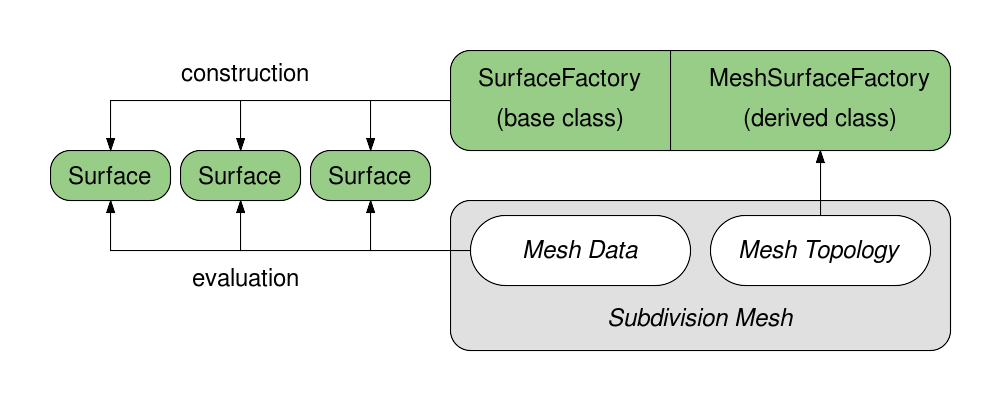
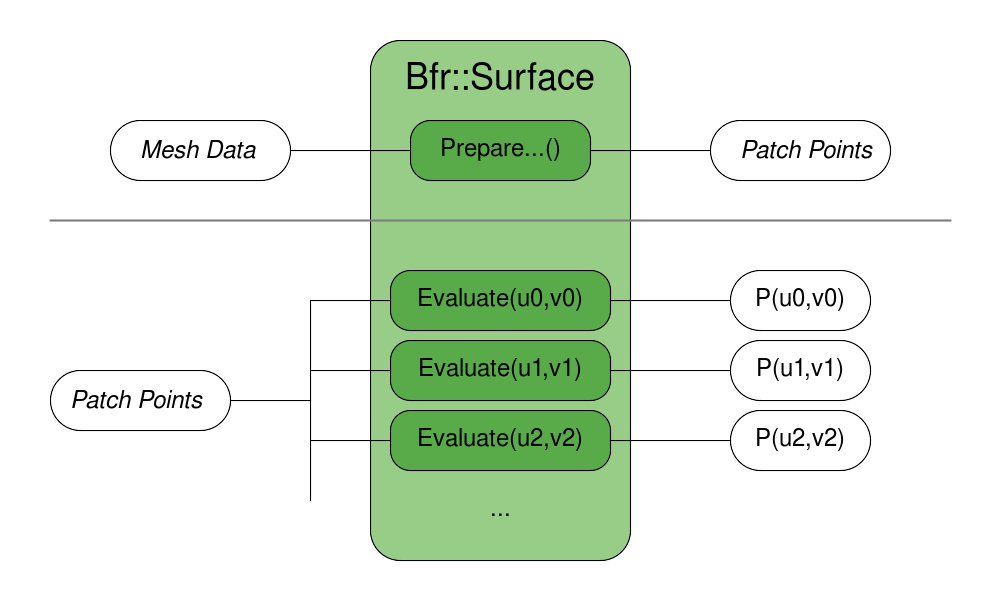

..
     Copyright 2022

     Licensed under the Apache License, Version 2.0 (the "Apache License")
     with the following modification; you may not use this file except in
     compliance with the Apache License and the following modification to it:
     Section 6. Trademarks. is deleted and replaced with:

     6. Trademarks. This License does not grant permission to use the trade
        names, trademarks, service marks, or product names of the Licensor
        and its affiliates, except as required to comply with Section 4(c) of
        the License and to reproduce the content of the NOTICE file.

     You may obtain a copy of the Apache License at

         http://www.apache.org/licenses/LICENSE-2.0

     Unless required by applicable law or agreed to in writing, software
     distributed under the Apache License with the above modification is
     distributed on an "AS IS" BASIS, WITHOUT WARRANTIES OR CONDITIONS OF ANY
     KIND, either express or implied. See the Apache License for the specific
     language governing permissions and limitations under the Apache License.

BFR Overview
------------

.. contents::
   :local:
   :backlinks: none

Base Face Representation (Bfr)
==============================

*Bfr* is an alternate API layer that treats a subdivision mesh provided
by a client as a piecewise parameteric surface primitive (see docs).

The name *Bfr* derives from the fact that the concepts and classes of
this interface all relate to the "base faces" of a mesh.  Concepts such
as parameterization, evaluation and tessellation all refer to and are
embodied by classes that deal with a specific face of the original
unrefined mesh.

The *Bfr* interfaces allow the limit surface for a single face to be
identified and evaluated independently of all other faces without any
global pre-processing. While concepts and utilities from the *Far*
interface are used internally, their complexity is hidden.  There is no
need to coordinate adaptive refinement with tables of patches, stencils,
Ptex indices, patch maps, etc.

The resulting evaluation interface is much simpler, more flexible and
more scalable than those assembled with the *Far* classes -- providing
a preferable alternative for many CPU-based use cases.

The main classes in *Bfr* include:

+------------------+----------------------------------------------------------+
| SurfaceFactory   | A light-weight interface to a mesh that constructs       |
|                  | pieces of limit surface for specified faces of a mesh    |
|                  | in the form of Surfaces.                                 |
+------------------+----------------------------------------------------------+
| Surface          | A class encapsulating the limit surface of a face with   |
|                  | methods for complete parameteric evaluation.             |
+------------------+----------------------------------------------------------+
| Parameterization | A simple class defining the available parameterizations  |
|                  | of faces and identifying that of a particular face.      |
+------------------+----------------------------------------------------------+
| Tessellation     | A simple class providing information about a specified   |
|                  | tessellation pattern for a given Parameterization.       |
+------------------+----------------------------------------------------------+

*Bfr* is well suited to cases where evaluation of the mesh may be sparse,
dynamically determined or iterative (Newton, gradient descent, etc).
It is not intended to replace the cases for which *Far* has been designed
(i.e. repeated evaluation of a fixed set of points) but is intended to
complement them.  However, while simplicity and flexibility were its major
goals, the resulting interface often outperforms the table-based interface
of *Far* in many common cases -- both in terms of execution time and
memory use.

An area that *Bfr* does not address, and where *Far* remains more suited,
is capturing a specific representation of the limit surface for other uses.
*Bfr* intentionally keeps internal implementation details private to allow
future improvements or extensions. Those representation details may be
publicly exposed in future releases, but until then, use of *Far* is
required for such purposes.

----

Evaluation
==========

Since subdivision surfaces are piecewise parameteric surfaces, the main
operation of interest of a surface primitive is evaluation.

*Bfr* deals with the limit surface of a mesh by identifying pieces of
the entire surface associated with each face of the mesh.  These pieces
of surface are referred to in *Bfr* as simply "surfaces" and represented
by Bfr::Surface.

Each face of the mesh has an implicit local 2D parameterization that is
used to evaluate its corresponding Surface. In general, 3- and 4-sided
faces use the same parameterizations for quad and triangular patches used
elsewhere in OpenSubdiv while those for other faces are more complex
(details on parameterizations to follow in the next section). So Surfaces
for all faces can be evaluated given 2D parameteric coordinate of its face.

+--------------------------------------+--------------------------------------+
| .. image:: images/param_uv.png       | .. image:: images/param_uv2xyz.png   |
|    :width:  100%                     |    :width:  100%                     |
|    :target: images/param_uv.png      |    :target: images/param_uv2xyz.png  |
+--------------------------------------+--------------------------------------+

Given an instance of a mesh, usage first requires the creation of a
Bfr::SurfaceFactory corresponding to that mesh -- from which Surfaces
will be created for evaluation. Construction of the SurfaceFactory
involves no pre-processing and Surfaces can be created and discarded
as needed.  The processes of constructing and evaluating Surfaces are
described in more detail below.

Bfr::SurfaceFactory
*******************

Construction of Bfr::Surfaces requires an instance of Bfr::SurfaceFactory.

An instance of SurfaceFactory is a light-weight interface to an instance
of a mesh that requires little to no construction cost or memory. The
SurfaceFactory does no work until a Surface is requested for a particular
face -- at which point the factory inspects the mesh topology around that
face to assemble the Surface.

SurfaceFactory is actually a base class that is inherited to provide a
consistent construction interface for Surfaces. Subclasses are derived
to support a particular class of connected mesh -- to implement the
topology inspection around each face required to construct the Surface.
Use of these subclasses is very simple given the public interface of
SurfaceFactory, but defining such a subclass is not. That more complex
use case of SurfaceFactory will be described in detail later with other
more advanced topics.

But defining a subclass of SurfaceFactory is not necessary in many cases,
as the tutorials for *Bfr* illustrate.  If already using OpenSubdiv for
other reasons, a Far::TopologyRefiner will have been constructed to
represent the initial base mesh before refinement. *Bfr* provides a
subclass of SurfaceFactory using Far::TopologyRefiner as the base mesh
(ignoring any levels of refinement). And when dealing with raw,
unconnected mesh data, the Far::TopologyRefiner provides a reasonably
efficient connected representation that can be constructed (see the
*Far* tutorials) for subsequent use with its SurfaceFactory subclass.

Given the different interpolation types for mesh data (i.e. "vertex",
"varying" and "face-varying"), the common interface for SurfaceFactory
provides methods to construct Surfaces for the different data types.
So for positions, the methods for "vertex" data must be used to obtain
the desired Surface, while for texture coordinates the methods for
"face-varying" data must be used, e.g.:

.. code:: c++

    Surface * CreateVertexSurface(     Index faceIndex) const;
    Surface * CreateVaryingSurface(    Index faceIndex) const;
    Surface * CreateFaceVaryingSurface(Index faceIndex) const;

These construction methods create distinct Surfaces as the underlying
representations of the Surfaces and the indices of the data that
defines them will often differ, e.g. the position data may require a
bicubic patch while the face-varying texture data may be linear or
bicubic in some variation (given separate face-varying interpolation
rules).

While the internal representations of the Surfaces constructed for
different data interpolation types may differ, they are all Surfaces
and so the interface to evaluate them does not.

Bfr::Surface
************

The Surface class encapsulates the piece of limit surface for a
particular face of the mesh. The term "surface" is used rather than
"patch" to emphasize that the Surface itself may be composed of more
than one patch (potentially a complex set of patches).

Once created, there are two steps required to evaluate a Surface:

    * preparation of associated data points from the mesh
    * the actual calls to evaluation methods using these data points

The latter is straight-forward, but the former warrants explanation.

The shape of a Surface is influenced by a set of control vertices for
the face and others in its neighborhood, and those vertices are
identified as part of its construction (and are publicly available
for inspection).  Those control vertices may be sufficient to define
the Surface when it is regular, but any irregularity (extra-ordinary
vertex, crease, etc.) requires additional points to be computed from
those control vertices in order to evaluate it efficiently.

Having previously avoided use of the term "patch" in favor of "surface",
the points gathered or computed from the control vertices are referred
to as "patch points". In part this is to distinguish them from the
control vertices of the mesh (patch points are assembled in a local
array, while control vertices are indexed from mesh buffers) but also
because these points do ultimately represent the control points of
the one or more patches that comprise the Surface:

Once the patch points for a Surface are prepared, they can be passed to
the main evaluation methods with the desired parameteric coordinates.
Methods exist for evaluating 0th, 1st and/or 2nd derivatives and all are
defined as templates to support evaluation in single or double precision,
e.g.:

.. code:: c++

    //  Preparing patch points:
    template <class T, class U>
    void PreparePatchPointValues(T const & meshVertices,
                                 U       & patchPoints) const;

    //  Evaluating position and 1st derivatives:
    template <typename REAL, class T, class U>
    void Evaluate(REAL const uv[2], T const & patchPoints, U * P,
                                                           U * Du,
                                                           U * Dv) const;

Depending on the complexity of the limit surface (presence of one or more
extra-ordinary vertices, creasing, etc.) this preparation of patch points
can be costly -- especially if only evaluating the Surface once or twice.
In such cases, it is worth considering evaluating "limit stencils", i.e.
sets of coefficients that combine the original control vertices of the
mesh without requiring the computation of intermediate values. The cost
of evaluating stencils is considerably higher than direct evaluation, but
in cases of sparse evaluation it can be worth it.

Surfaces should be considered a class for transient use.  They are
non-copyable and retaining them for longer term usage reduces their
benefits. But the initialization cost of irregular Surfaces can be a
deterrent and motive their retention despite increased memory costs.
Retaining all Surfaces of a mesh for random sampling is a situation
that should be undertaken with caution and will be discussed in more
detail later with other advanced topics.

----

Parameterization
================

Each face of a mesh has an implicit local 2D parameterization, and that
parameterization is used to evaluate the Surface for that face.

As a starting point, *Bfr* adopts the parameterizations defined elsewhere
in OpenSubdiv for quadrilateral and triangular patches, for use with 4-
and 3-sided faces in most cases:

+----------------------------------------------+----------------------------------------------+
| .. image:: images/bfr_param_patch_quad.png   | .. image:: images/bfr_param_patch_tri.png    |
|    :align:  center                           |    :align:  center                           |
|    :width:  100%                             |    :width:  100%                             |
|    :target: images/bfr_param_patch_quad.png  |    :target: images/bfr_param_patch_tri.png   |
+----------------------------------------------+----------------------------------------------+

But the parameterization of a face is also dependent on the subdivision
scheme applied to it.

Subdivision schemes that divide faces into quads are ultimately represented
by quadrilateral patches.  So a face that is a quad can be parameterized as
a single quad, but other non-quad faces are parameterized as a set of quad
"sub-faces" (faces resulting from subdivision).

+-------------------------------------------+
| .. image:: images/bfr_param_subfaces.png  |
|    :align:  center                        |
|    :width:  100%                          |
|    :target: images/bfr_param_subfaces.png |
+-------------------------------------------+

A triangle subdivided with a quad-based scheme (e.g. Catmull-Clark) will
therefore not have the parameterization of the triangular patch indicated
previously, but another defined by its quad sub-faces illustrated above
(to be desribed below).

Subdivision schemes that divide faces into triangles are currently restricted
to triangles only, so all faces are parameterized as single triangles. (If
Loop subdivision is extended to non-triangles in future, a parameterization
involving triangular sub-faces will be necessary.)

Note that triangles are often parameterized elsewhere in terms of barycentric
coordinates (u,v,w) where *w = 1 - u - v*. As is the case elsewhere in
OpenSubdiv, *Bfr* considers parameteric coordinates as 2D (u,v) pairs for all
purposes.  All faces have an implicit 2D local parameterization and all
interfaces requiring parametric coordinates consider only the (u,v) pair.
If interaction with some other toolset requiring barycentric coordinates
for triangles is necessary, it is left to users to compute the implicit *w*
accordingly.

Bfr::Parameterization
*********************

Bfr::Parameterization is a simple class that fully defines the parameterization
for a particular face.

A Parameterization is fully defined (on construction) given the "size" of a
face and the subdivision scheme applied to it (where the face "size" is its
number of vertices/edges). Since any parameterization of *N*-sided faces
requires *N* in some form, the face size is stored as a member and made
publicly available.

Each Surface has the Parameterization of its face assigned internally as part
of its construction, and that is used internally by the Surface in many of its
methods. The need to deal directly with the explicit details of the
Paramaterization class is not always necessary, but is unavoidable in some
cases. Often it is sufficient to retrieve the Parameterization from a Surface
for use in some other context (e.g. passed to Bfr::Tessellation).

The enumerated type Parameterization::Type currently supports three kinds of
parameterizations:

+---------------+--------------------------------------------------------------+
| QUAD          | Applied to quadrilateral faces with a quad-based             |
|               | subdivision scheme (e.g. Catmark or Bilinear).               |
+---------------+--------------------------------------------------------------+
| TRI           | Applied to triangular faces with a triangle-based            |
|               | subdivision scheme (e.g. Loop).                              |
+---------------+--------------------------------------------------------------+
| QUAD_SUBFACES | Applied to non-quad faces with a quad-based subdivision      |
|               | scheme -- dividing the face into quadrilateral sub-faces.    |
+---------------+--------------------------------------------------------------+

Parameterizations that involve subdivision into sub-faces, e.g. QUAD_SUBFACES,
may warrant some care as they are not continuous. Depending on how they are
defined, the sub-faces may be disjoint or overlap in parametric space.
To help these situations, methods to detect and determine sub-faces are
available.

Bfr::Parameterization defines a quadrangulated sub-face parameterization
differently from the *Far* and *Osd* interfaces in OpenSubdiv.  For an
*N*-sided face, *Far* uses a parameterization adopted by Ptex. In this
case, all quad sub-faces are parameterized over the unit square and
require an additional index of the sub-face to identify them. So Ptex
coordinates require three values:  the index and (u,v) of the sub-face.

To embed sub-face coordinates in a single (u,v) pair, *Bfr* tiles the
sub-faces in disjoint regions in parameter space. This tiling is similar
to the Udim convention for textures, where a UDim on the order of *sqrt(N)*
is used to to preserve accuracy for increasing *N*:

+---------------------------------------------+------------------------------------------------------------+
| .. image:: images/bfr_param_subfaces_5.png  | .. image:: images/bfr_param_subfaces_5_uv.png              |
|    :align:  center                          |    :align:  center                                         |
|    :width:  100%                            |    :width:  100%                                           |
|    :target: images/bfr_param_subfaces_5.png |    :target: images/bfr_param_subfaces_5_uv.png             |
+---------------------------------------------+------------------------------------------------------------+

|

+---------------------------------------------+------------------------------------------------------------+
| .. image:: images/bfr_param_subfaces_3.png  | .. image:: images/bfr_param_subfaces_3_uv.png              |
|    :align:  center                          |    :align:  center                                         |
|    :width:  100%                            |    :width:  100%                                           |
|    :target: images/bfr_param_subfaces_3.png |    :target: images/bfr_param_subfaces_3_uv.png             |
+---------------------------------------------+------------------------------------------------------------+

Note also that the edges of each sub-face are of parameteric length 0.5,
which results in a total parameteric length of 1.0 for all base edges.
This differs again from Ptex, which parameterizes sub-faces with edge
lengths of 1.0, and so can lead to inconsistencies in parameteric scale
(typically with derivatives) across edges of the mesh if not careful.

----

Tessellation
============

Once a Surface can be evaluated it can be tessellated.  Given a 2D
pararameterization, a tessellation consists of two parts:

    * a set of parameteric coordinates sampling the Parameterization
    * a set of faces connecting these coordinates that covers the
      entire Parameterization

Once evaluated, the set of resulting sample points and the faces
connecting them effectively define a mesh for that parameterization.

For the sake brevity, the parameteric coordinates or sample points are
referred to simply as "coords" or "Coords" in the documentation and
interface respectively -- avoiding the term "points" which is already
a heavily overloaded term.  Similarly the faces connecting the coords
are referred to as "facets" or "Facets" -- avoiding the term "face" to
avoid confusion with the face of the mesh that is being tessellated.

*Bfr* provides a simple class to support a variety of tesselltion patterns
for the different Paremeterization types and methods for retrieving its
assocated coords and facets. In many cases the patterns they define are
similar to those of GPU hardware tessellation -- which may be more familiar
to many -- but they differ in several ways, as noted below.

Bfr::Tessellation
*****************

In *Bfr* a Tessellation is a simple class defined by a given Paremeterization
and a set of tessellation rates (and a few additional options). These two
elements define a specific tessellation pattern for all faces sharing that
Parameterization. An instance of Tessellation can then be inspected to
identify all or subsets of its coords or facets.

Note that facets do not have to be triangles, as expected of tessellation
in other contexts. While producing triangular facets is the default, options
are available to have Tessellations produce patterns for parameterizations
associated with quad-based subdivision schemes that are similar in topology
to subdivision:

+--------------------------------------------+--------------------------------------------+
| .. image:: images/bfr_tess_quad_quads.png  | .. image:: images/bfr_tess_quad_tris.png   |
|    :align:  center                         |    :align:  center                         |
|    :width:  100%                           |    :width:  100%                           |
|    :target: images/bfr_tess_quad_quads.png |    :target: images/bfr_tess_quad_tris.png  |
+--------------------------------------------+--------------------------------------------+
| .. image:: images/bfr_tess_pent_quads.png  | .. image:: images/bfr_tess_pent_tris.png   |
|    :align:  center                         |    :align:  center                         |
|    :width:  100%                           |    :width:  100%                           |
|    :target: images/bfr_tess_pent_quads.png |    :target: images/bfr_tess_pent_tris.png  |
+--------------------------------------------+--------------------------------------------+
| Tessellation of 4- and 5-sided faces of a quad-based scheme using quadrilateral facets  |
| (left) and triangular (right)                                                           |
+-----------------------------------------------------------------------------------------+

The name "Tessellation" was chosen rather than "Tessellator" as it is a
passive class that simply holds information define its pattern. It doesn't
do much other than providing information about the pattern when requested.
A few general properties about the pattern are determined and retained on
construction, after which an instance is immutable.  So it does not maintain
any additional state between queries.

In order to provide flexibility when dealing with tessellations of adjacent
faces, the coords arising from a Bfr::Tessellation are ordered and are
retrievable in ways to help associate points along edges that may be shared
between the two faces.  The coords of a Tessellation are generated in
concentric rings, beginning with the outer ring and starting with the first
vertex:

+---------------------------------------------+---------------------------------------------+
| .. image:: images/bfr_tess_quad_order.png   | .. image:: images/bfr_tess_tri_order.png    |
|    :align:  center                          |    :align:  center                          |
|    :width:  100%                            |    :width:  100%                            |
|    :target: images/bfr_tess_quad_order.png  |    :target: images/bfr_tess_tri_order.png   |
+---------------------------------------------+---------------------------------------------+
| Ordering of coords around boundary for quad and tri parameterizations.                    |
+-------------------------------------------------------------------------------------------+

Tessellation methods allow the coords associated with specific vertices or
edges to be identified, as well as providing the coords for the entire ring
around the boundary separately from those of the interior if desired. While
the ordering of coords in the interior is not guaranteed, the ordering of
the boundary coords is specifically fixed to support the correllation of
potentially shared coords between faces.

It's worth noting that the Tessellation class is completely independent
of the Surface class.  Tessellation simply takes a Parameterization and
tessellation rates and provides the coords and facets that define its
pattern. So Tessellation can be used in any other evaluation context where
the Parameterizations are appropriate.

Tessellation Rates
******************

For a particular Parameterization, the various tessellation patterns are
detemined by one or more tessellation rates. Unlike other interfaces to
tessellation, rather than specifying the many rates for the most complex
patterns, simpler patterns can be specified more simply -- with one or
some lesser number of rates than the maximum possible.

The simplest set of patterns uses a single tessellation rate and is said
to be "uniform", i.e. all edges and the interior of the face are split to
a similar degree:

+---------------------------------------------+---------------------------------------------+
| .. image:: images/bfr_tess_uni_quad_5.png   | .. image:: images/bfr_tess_uni_quad_8.png   |
|    :align:  center                          |    :align:  center                          |
|    :width:  100%                            |    :width:  100%                            |
|    :target: images/bfr_tess_uni_quad_5.png  |    :target: images/bfr_tess_uni_quad_8.png  |
+---------------------------------------------+---------------------------------------------+
| .. image:: images/bfr_tess_uni_tri_5.png    | .. image:: images/bfr_tess_uni_tri_8.png    |
|    :align:  center                          |    :align:  center                          |
|    :width:  100%                            |    :width:  100%                            |
|    :target: images/bfr_tess_uni_tri_5.png   |    :target: images/bfr_tess_uni_tri_8.png   |
+---------------------------------------------+---------------------------------------------+
| Uniform tessellation of a quadrilateral and triangle with rates of 5 and 8.               |
+-------------------------------------------------------------------------------------------+

More complex non-uniform patterns allow the edges of the face to be split
independently from the interior of the face.  Given rates for each edge, a
suitable uniform rate for the interior can be either inferred or specified
explicitly. These are typically referred to as the "outer rates" and the
"inner rate". (The single rate specified for a simple uniform tessellation
is essentially the specification of a single inner rate while the outer
rates for all edges are inferred as the same.)

+------------------------------------------------+------------------------------------------------+
| .. image:: images/bfr_tess_nonuni_quad_A.png   | .. image:: images/bfr_tess_nonuni_quad_B.png   |
|    :align:  center                             |    :align:  center                             |
|    :width:  100%                               |    :width:  100%                               |
|    :target: images/bfr_tess_nonuni_quad_A.png  |    :target: images/bfr_tess_nonuni_quad_B.png  |
+------------------------------------------------+------------------------------------------------+
| .. image:: images/bfr_tess_nonuni_tri_A.png    | .. image:: images/bfr_tess_nonuni_tri_B.png    |
|    :align:  center                             |    :align:  center                             |
|    :width:  100%                               |    :width:  100%                               |
|    :target: images/bfr_tess_nonuni_tri_A.png   |    :target: images/bfr_tess_nonuni_tri_B.png   |
+------------------------------------------------+------------------------------------------------+
| .. image:: images/bfr_tess_nonuni_pent_A.png   | .. image:: images/bfr_tess_nonuni_pent_B.png   |
|    :align:  center                             |    :align:  center                             |
|    :width:  100%                               |    :width:  100%                               |
|    :target: images/bfr_tess_nonuni_pent_A.png  |    :target: images/bfr_tess_nonuni_pent_B.png  |
+------------------------------------------------+------------------------------------------------+
| Non-uniform tessellation of a quadrilateral, triangle and 5-sided face                          |
| with various outer and inner rates.                                                             |
+-------------------------------------------------------------------------------------------------+

In the case of Parameterizations for quads, it is common elsewhere to
associate two inner rates with the opposing edges.  So two separate
inner rates are available for quad parameterizations -- to be specified
or otherwise inferred:

+---------------------------------------------+---------------------------------------------+
| .. image:: images/bfr_tess_mXn_quad_A.png   | .. image:: images/bfr_tess_mXn_quad_B.png   |
|    :align:  center                          |    :align:  center                          |
|    :width:  100%                            |    :width:  100%                            |
|    :target: images/bfr_tess_mXn_quad_A.png  |    :target: images/bfr_tess_mXn_quad_B.png  |
+---------------------------------------------+---------------------------------------------+
| Quad tessellations with differing inner rates with matching and varying outer rates.      |
+-------------------------------------------------------------------------------------------+

Differences from Hardware Tessellation
**************************************

Since the specifications for hardware tessellation often leave some details
of the patterns as implementation dependent, no two hardware implementations
are necessarily the same. Typically there may be subtle differences in the
non-uniform tessellation patterns along boundaries, and that is to be exected
here.

*Bfr* does provide some obvious additional functionality not present in
hardware tessellation and vice versa, e.g *Bfr* provides the following (not
supported by hardware tessellation):

    * patterns for parameterizations other than quads and tris (e.g. N-sided)
    * preservation of quad facets of quad-based parameterizations

while hardware tessellation provides the following (not supported by *Bfr*):

    * patterns for so-called "fractional" tessellation (non-integer rates)

The lack of fractional tessellation in *Bfr* is something that may be
addressed in a future release.

Where the functionality of *Bfr* and hardware tessellation overlap, a few
other differences are worth noting:

    * indexing of edges and their associated outer tessellation rates
    * uniform tessellation patterns for triangles differ significantly

For the indexing of edges and rates, when specifying an outer rate associated
with an edge, the array index for rate *i* is expected to correspond to edge
*i*.  *Bfr* follows the convention established elsewhere in OpenSubdiv of
labeling/indexing edges 0, 1, etc. betwen vertex pairs [0,1], [1,2], etc.
So outer rate [0] corresponds to the edge between vertices [0,1]. In contrast,
hardware tessellation associates the rate for the edge between vertices [0,1]
as outer rate [1] -- its outer rate [0] is between vertices [N-1,0].  So an
offset of 1 is warranted when comparing the two.

+------------------------------------------------+------------------------------------------------+
| .. image:: images/bfr_tess_diff_edges_osd.png  | .. image:: images/bfr_tess_diff_edges_gpu.png  |
|    :align:  center                             |    :align:  center                             |
|    :width:  100%                               |    :width:  100%                               |
|    :target: images/bfr_tess_diff_edges_osd.png |    :target: images/bfr_tess_diff_edges_gpu.png |
+------------------------------------------------+------------------------------------------------+
| Outer edge tessellation rates of {1,3,5,7} applied to a quad with *Bfr* (left) and GPU          |
| tessellation (right).                                                                           |
+-------------------------------------------------------------------------------------------------+

For the uniform tessellation of triangles, its well known that the needs of
hardware implementation led designers to factor the patterns for triangles
to make use of the same hardware necessary for quads. As a result, many edges
are introduced into a simple tessellation of a triangle that are not parallel
to one of its three edges.

*Bfr* uses patterns more consistent with those resulting from the subdivision
of triangles. Only edges parallel to the edges of the triangle are introduced,
which both reduces the number of facets as well as reducing some of the
artifacts of the hardware patterns:

+----------------------------------------------+----------------------------------------------+
| .. image:: images/bfr_tess_diff_tri_osd.png  | .. image:: images/bfr_tess_diff_tri_gpu.png  |
|    :align:  center                           |    :align:  center                           |
|    :width:  100%                             |    :width:  100%                             |
|    :target: images/bfr_tess_diff_tri_osd.png |    :target: images/bfr_tess_diff_tri_gpu.png |
+----------------------------------------------+----------------------------------------------+
| Uniform tessellation of a triangle with *Bfr* (left) and GPU tessellation (right).          |
+---------------------------------------------------------------------------------------------+

These triangular patterns are consistent with what Moreton referred to as "interger
spacing" for triangular patches in early work on hardware tessellation [Moreton, 2001],
but which were later lost in the actual hardware implementation.

----

SurfaceFactory Usage
====================

Deferred pending review... possible topics to include (in no particular
order):

    * internal caching and declarations for thread-safety
    * lifetime/ownership of Surfaces and SurfaceFactory, cache, etc.
    * use of an external cache shared between SurfaceFactories (meshes)
    * explicit external caching of entire Surfaces

----

SurfaceFactory Subclasses
=========================

Deferred pending review... possible topics to include (in no particular
order):

    * fulfilling the topology requirements
    * fulfilling the internal caching requirements

